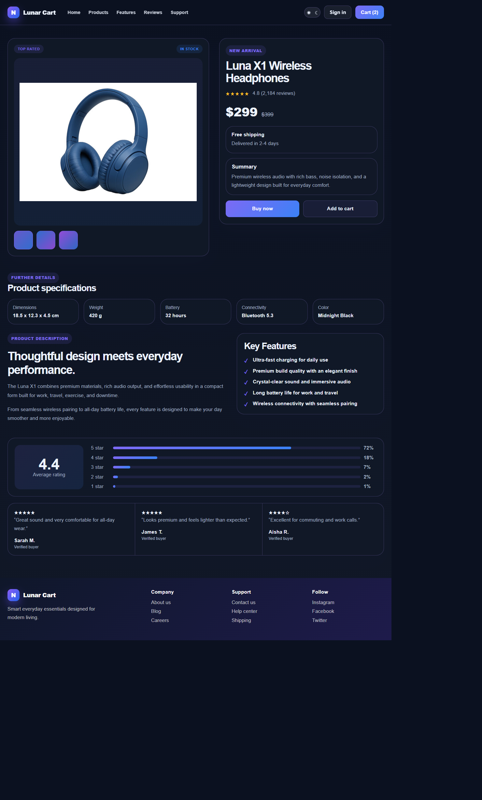

# Luna Cart

Luna Cart is a demo project showcasing a polished, single-product ecommerce storefront. It is intended as a frontend UI demo, not a production shop.



## Highlights

- Responsive product page with product imagery, pricing, availability, and purchase controls
- Product specifications and feature list
- Sample customer ratings and review cards
- Dark and light theme toggle
- React 19, TypeScript, and Parcel

Cart, sign-in, purchase, and review content is illustrative; no payment, account, or commerce backend is connected.

## Run locally

Requirements: Node.js and npm.

```bash
cd frontend
npm install
npm start
```

Parcel prints the local development URL in the terminal.

## Production build

```bash
cd frontend
npm run build
```
